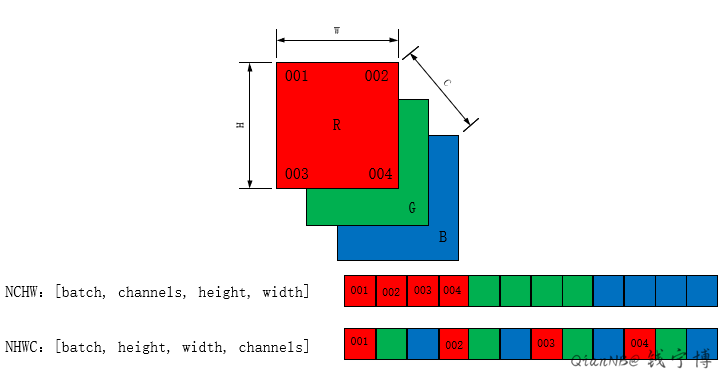
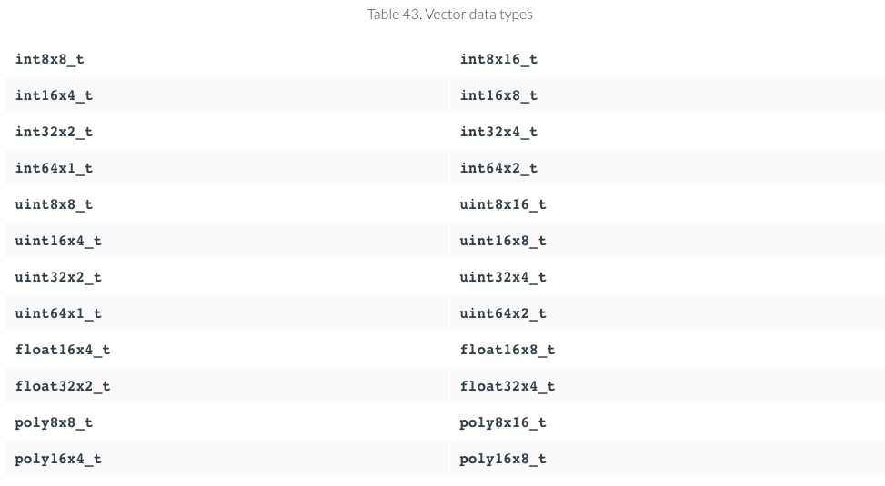
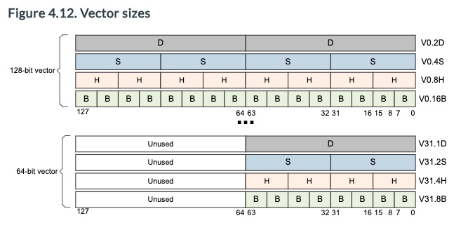

### 简介

在模型预测过程中，经常有的模型输出的图像处理后的数据，如二次元（二次元效果的bgr数据）、图像修复（修复之后的图片对应的bgr数据），但通常模型输出的数据格式nchw格式，但opencv需要的是nhwc格式，这里对nchw和nhwc格式做下简单的说明。

```
根据TensorFlow官方文档，N、C、H、W代表意义如下：

N：一个batch内图片的数量。
H：垂直高度方向的像素个数。
W：水平宽度方向的像素个数。
C：通道数。例如灰度图像为1， 彩色RGB图像为3。
```




## 具体转换过程


### 版本一：C语言版本

```c
// 逐行进行转换
// resBgrTextureBuf 保存转换结果nhwc的buffer
for (int y = 0; y < res_height; ++y) {
    
	unsigned char *p = &resBgrTextureBuf[y * res_width * 3];
    for (int x = 0; x < res_width; ++x){
		for (int c = 0; c < 3; ++c){
			
            int i = x * 3 + c;
            int base_off = res_width * res_height * c;
            float value = model_output_dat_ptr[base_off + y * res_width + x] / 2.0 + 0.5;
			p[i] = (unsigned char)((value < 0.0 ? 0.0 : (1.0 < value ? 1.0 : value)) * 255);
		}
	}
}
```


### 版本二：neon intrinsics版本

```c
{ // 赋值结果
int stride_len = res_height * res_width;
// 模型输出的nchw bgr数据
float *output_ptr_b = output_ptr;
float *output_ptr_g = output_ptr + stride_len;
float *output_ptr_r = output_ptr + stride_len * 2;

// 转换成nhwc后的bgr数据
// float* dout_result_bgr = resBgrTextureBufferFloat;
uint8_t* dout_result_bgr = resBgrTextureBuffer;

float32x4_t v_const_value_0_5 = vdupq_n_f32(0.5f);
float32x4_t v_const_value_255_0 = vdupq_n_f32(255.f);
int i = 0;
for (; i < stride_len - 3; i += 4) {     // 每次处理4个像素

float32x4_t vin_b = vld1q_f32(output_ptr_b);    // 顺序读取4个像素
float32x4_t vin_g = vld1q_f32(output_ptr_g);
float32x4_t vin_r = vld1q_f32(output_ptr_r);

float32x4_t vmul0 = vmulq_f32(vin_b, v_const_value_0_5);
float32x4_t vmul1 = vmulq_f32(vin_g, v_const_value_0_5);
float32x4_t vmul2 = vmulq_f32(vin_r, v_const_value_0_5);

float32x4_t vadd0 = vaddq_f32(vmul0, v_const_value_0_5);
float32x4_t vadd1 = vaddq_f32(vmul1, v_const_value_0_5);
float32x4_t vadd2 = vaddq_f32(vmul2, v_const_value_0_5);

float32x4_t vres0 = vmulq_f32(vadd0, v_const_value_255_0);
float32x4_t vres1 = vmulq_f32(vadd1, v_const_value_255_0);
float32x4_t vres2 = vmulq_f32(vadd2, v_const_value_255_0);

// float32 to unsigned int32
uint32x4_t vres0_int32 = vcvtq_u32_f32 (vres0);
uint32x4_t vres1_int32 = vcvtq_u32_f32 (vres1);
uint32x4_t vres2_int32 = vcvtq_u32_f32 (vres2);

uint16x4_t vres0_int16 = vqmovn_u32(vres0_int32);
uint16x4_t vres1_int16 = vqmovn_u32(vres1_int32);
uint16x4_t vres2_int16 = vqmovn_u32(vres2_int32);

uint8x8_t vout_8_0 = vqmovn_u16(vcombine_u16(vres0_int16, vres0_int16));
uint8x8_t vout_8_1 = vqmovn_u16(vcombine_u16(vres1_int16, vres1_int16));
uint8x8_t vout_8_2 = vqmovn_u16(vcombine_u16(vres2_int16, vres2_int16));

uint8x8x3_t vout_bgr8 = {vout_8_0, vout_8_1, vout_8_2};
// 模型输出结果指针
output_ptr_b += 4;
output_ptr_g += 4;
output_ptr_r += 4;

vst3_u8(dout_result_bgr, vout_bgr8);
// unsigned char 结果
dout_result_bgr += 12;      // 4个像素 12个unsigned char
}

// TODO 剩余元素
// for (; i < stride_len; i++) {   // 一个像素一个像素处理
//        *(dout_result_bgr++) = (*(output_ptr_b++) * 0.5f) + 0.5f;
//        *(dout_result_bgr++) = (*(output_ptr_g++) * 0.5f) + 0.5f;
//        *(dout_result_bgr++) = (*(output_ptr_r++) * 0.5f) + 0.5f;
//  }

}
```

##### NEON  intrinsic函数索引：

neon intrinsics 函数可以参考官网，相关intrinsics都可以在这查到：

<https://developer.arm.com/docs/dui0491/i/using-neon-support/summary-of-neon-intrinsics>

##### Vector数据类型

NEON矢量数据类型根据以下模式命名，

```C
 <type><size>x<number of lanes>_t
```

例如： `int16x4_t` is a **vector** containing **four lanes** each containing **a signed** 16-bit **integer**.

已有数据类型：




### 版本三：neon 汇编版本


#### AARCH64版本

这里我们先看**arm64**版本实现，后面再补充下armv7版本

```c

int stride_len = res_height * res_width;
// 模型输出的nchw排列bgr数据每个channel的首地址
float *output_ptr_b = model_output_dat_ptr;
float *output_ptr_g = model_output_dat_ptr + stride_len;
float *output_ptr_r = model_output_dat_ptr + stride_len * 2;

// 转换成nhwc后的bgr数据处理的buffer
uint8_t *dout_result_bgr = resBgrTextureBuf;

float32x4_t v_const_value_0_5 = vdupq_n_f32(0.5f);
float32x4_t v_const_value_255_0 = vdupq_n_f32(255.f);
int i = 0;

for (; i < stride_len - 7; i += 8) { // 每次处理8个像素, 一个像素4个字节(float)

    #ifdef __aarch64__
    asm volatile(
        "ldp  q0, q1, [%[in_b]], #32       \n"
        "ldp  q2, q3, [%[in_g]], #32       \n"
        "ldp  q4, q5, [%[in_r]], #32       \n"

        "fmul    v6.4s, v0.4s, %[scale].4s  \n"
        "fmul    v7.4s, v1.4s, %[scale].4s  \n"
        "fmul    v8.4s, v2.4s, %[scale].4s \n"
        "fmul    v9.4s, v3.4s, %[scale].4s \n"
        "fmul    v10.4s, v4.4s, %[scale].4s  \n"
        "fmul    v11.4s, v5.4s, %[scale].4s  \n"

        "fadd    v0.4s, v6.4s, %[scale].4s  \n"
        "fadd    v1.4s, v7.4s, %[scale].4s  \n"
        "fadd    v2.4s, v8.4s, %[scale].4s \n"
        "fadd    v3.4s, v9.4s, %[scale].4s \n"
        "fadd    v4.4s, v10.4s, %[scale].4s  \n"
        "fadd    v5.4s, v11.4s, %[scale].4s  \n"

        "fmul    v6.4s, v0.4s, %[const_255].4s  \n"
        "fmul    v7.4s, v1.4s, %[const_255].4s  \n"
        "fmul    v8.4s, v2.4s, %[const_255].4s \n"
        "fmul    v9.4s, v3.4s, %[const_255].4s \n"
        "fmul    v10.4s, v4.4s, %[const_255].4s  \n"
        "fmul    v11.4s, v5.4s, %[const_255].4s  \n"

        /* fp32 - unsigned int32 */
        "FCVTAU v0.4s, v6.4s                        \n"
        "FCVTAU v1.4s, v7.4s                        \n"
        "FCVTAU v2.4s, v8.4s                       \n"
        "FCVTAU v3.4s, v9.4s                       \n"
        "FCVTAU v4.4s, v10.4s                       \n"
        "FCVTAU v5.4s, v11.4s                       \n"

        "SQXTUN    v6.4h, v0.4s                      \n"
        "SQXTUN2   v6.8h, v1.4s                      \n"
        "SQXTUN    v7.4h, v2.4s                     \n"
        "SQXTUN2   v7.8h, v3.4s                     \n"
        "SQXTUN    v8.4h, v4.4s                     \n"
        "SQXTUN2   v8.8h, v5.4s                     \n"

        "SQXTUN    v9.8b, v6.8h                      \n"
        "SQXTUN   v10.8b, v7.8h                     \n"
        "SQXTUN    v11.8b, v8.8h                      \n"

        "st3 {v9.8b-v11.8b} , [%[out]], #24             \n"

        : [in_b] "+r"(output_ptr_b),
        [in_g] "+r"(output_ptr_g),
        [in_r] "+r"(output_ptr_r),
        [out] "+r"(dout_result_bgr)
        : [scale] "w"(v_const_value_0_5),
        [const_255] "w"(v_const_value_255_0)
        : "cc",
        "memory",
        "v0",
        "v1",
        "v2",
        "v3",
        "v4",
        "v5",
        "v6",
        "v7",
        "v8",
        "v9",
        "v10",
        "v11");               

    #endif  // end __aarch64__
}

// TODO 剩余像素处理
// TODO

```

#####  ARMv8 指令集引用

<https://developer.arm.com/docs/100076/0100/instruction-set-reference>


#### NEON汇编指令 LDP&STP 加载&存取指令

Load Pair (LDP)和Store Pair (STP)指令，这两个指令只支持2个整数寄存器。

这个是arm64的指令。取8/16/32 数据只能用v*.8b .16b .4s




[Vector register sizes]: https://developer.arm.com/docs/den0024/latest/armv8-registers/neon-and-floating-point-registers/vector-register-sizes


#### ARMV7版本

​                

```c
asm volatile(
"vld1.32 {d0-d3},   [%[in_b]]!   @load data \n"
"vld1.32 {d4-d7},   [%[in_g]]!   @load data \n"
"vld1.32 {d8-d11},  [%[in_r]]!   @load data \n"

"vmul.f32 q6, q0, %q[scale]            \n"
"vmul.f32 q7, q1, %q[scale]            \n"
"vmul.f32 q8, q2, %q[scale]            \n"
"vmul.f32 q9, q3, %q[scale]            \n"
"vmul.f32 q10, q4, %q[scale]            \n"
"vmul.f32 q11, q5, %q[scale]            \n"

"vadd.f32 q0, q6, %q[scale]             \n"
"vadd.f32 q1, q7, %q[scale]             \n"
"vadd.f32 q2, q8, %q[scale]             \n"
"vadd.f32 q3, q9, %q[scale]             \n"
"vadd.f32 q4, q10, %q[scale]             \n"
"vadd.f32 q5, q11, %q[scale]             \n"

"vmul.f32 q6, q0, %q[const_255]            \n"
"vmul.f32 q7, q1, %q[const_255]            \n"
"vmul.f32 q8, q2, %q[const_255]            \n"
"vmul.f32 q9, q3, %q[const_255]            \n"
"vmul.f32 q10, q4, %q[const_255]            \n"
"vmul.f32 q11, q5, %q[const_255]            \n"

/* fp32 to int32 */
"vcvt.u32.f32  q0, q6    @ cvt to int32\n"
"vcvt.u32.f32  q1, q7    @ cvt to int32\n"
"vcvt.u32.f32  q2, q8    @ cvt to int32\n"
"vcvt.u32.f32  q3, q9    @ cvt to int32\n"
"vcvt.u32.f32  q4, q10    @ cvt to int32\n"
"vcvt.u32.f32  q5, q11    @ cvt to int32\n"

/* int32 to int16 */
"vqmovn.u32 d12, q0       @ cnt to int16\n"
"vqmovn.u32 d13, q1       @ cnt to int16\n"
"vqmovn.u32 d14, q2       @ cnt to int16\n"
"vqmovn.u32 d15, q3       @ cnt to int16\n"
"vqmovn.u32 d16, q4       @ cnt to int16\n"
"vqmovn.u32 d17, q5       @ cnt to int16\n"

/* int16 to int8 */
"vqmovn.u16 d0, q6       @ cnt to int8\n"
"vqmovn.u16 d1, q7       @ cnt to int8\n"
"vqmovn.u16 d2, q8      @ cnt to int8\n"

/* store data*/
"vst3.u8  {d0, d1, d2},    [%[out]]!   @ write "
: [in_b] "+r"(output_ptr_b),
[in_g] "+r"(output_ptr_g),
[in_r] "+r"(output_ptr_r),
[out] "+r"(dout_result_bgr)
: [scale] "w"(v_const_value_0_5),
[const_255] "w"(v_const_value_255_0)
: "cc",
"memory",
"q0",
"q1",
"q2",
"q3",
"q4",
"q5",
"q6",
"q7",
"q8",
"q9",
"q10",
"q11");
```


#####  A32/T32指令集引用

ARM把新的64位指令集叫做A64，运行在AArch64状态。原来的指令集叫做**A32和T32**，这两种指令集运行在**AArch32状态**，和ARMv7兼容。

ARMv8架构也包含一些32位指令集增强，使用这些特性，将和旧的ARMv7实现不兼容。

<https://developer.arm.com/docs/100076/0200/a32t32-instruction-set-reference>

